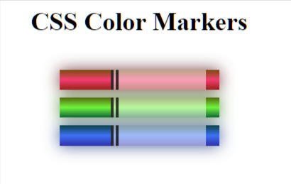

# FreeCodeCamp - Responsive Web Design Certification - Colored Markers

## Responsive Web Design Track at FreeCodeCamp

Follow this link for assigment
[Colored Markers by Free Code Camp](https://www.freecodecamp.org/learn/2022/responsive-web-design/#learn-css-colors-by-building-a-set-of-colored-markers)

### My notes
Nothing fancy, html basics
3rd Exercise that is project like

